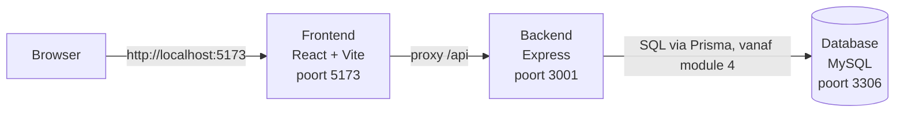

# Architectuur

```mermaid
flowchart LR
    B[Browser] -->|http://localhost:5173| F[Frontend<br/>React + Vite<br/>poort 5173]
    F -->|proxy /api| A[Backend<br/>Express<br/>poort 3001]
    A -->|SQL via Prisma, vanaf module 4| D[(Database<br/>MySQL<br/>poort 3306)]
```